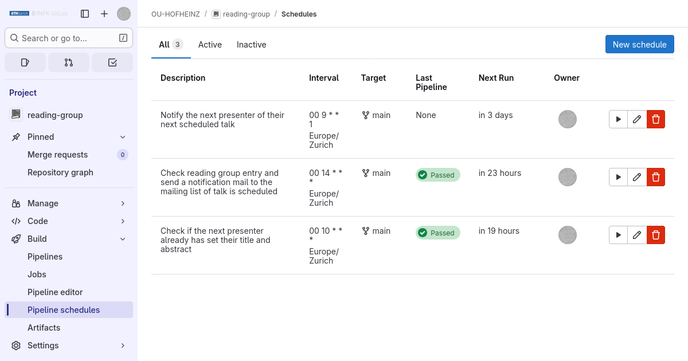
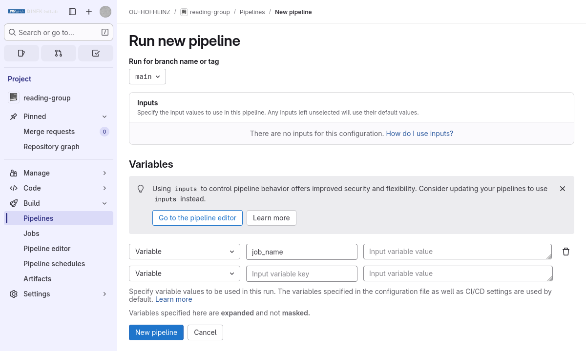

# Reading-group management
This repo allows to manage a mailing list for a reading group via gitlab CI/CD.
The `talks.json` file contains an array of specified talks.
The idea is that the members of the reading group can add their talks to the `talks.json` files.

Moreover, the admin of the reading group can add a proto-talk
```
    {
        "presenter": "John Doe",
        "presenter_mail": "john.doe@example.com",
        "title": "",
        "abstract": "",
        "url": "https:/ia.cr/yyyy/xxx",
        "date": "dd.mm.yyyy",
        "time": "hh:mm",
        "room": "E69"
    }
```
to `talks.json`.
A scheduled bot checks all talks periodically (every other day).
If a talk has an empty `title` or `abstract` (e.g. a proto-talk), the bot sends an automated reminder to the corresponding presenter to add details to their talk.

# Technical info
## Docker image
We use a docker image docker.io/focethz/reading-group:alpine to run on gitlab runners.
If you need to update the container, do the following:
```
# install podman, e.g. apt install podman (or docker)
# cd into this directory (contains Dockerfile)
podman build . -t docker.io/focethz/reading-group:alpine
podman login docker.io
# enter password
podman push docker.io/focethz/reading-group:alpine # this overwrite the old image / use a different version :alpine-x
```

## Pipelines
There are some [pipelines](https://docs.gitlab.com/ee/ci/pipelines/index.html) for several tasks.
[Scheduled pipelines](https://docs.gitlab.com/ee/ci/pipelines/schedules.html) are triggered periodically by the system (mostly for notification purposes).
Others are useful for debugging and manual corrections.

### Scheduled piplines
- `notify`:
Running `notify` sends a notification for each talk (whose `shouldSendNotificationMail` returns `true`) to the mailing list (specified in `list_address.js`).
- `remind`:
Running `remind` sends a reminder mail to the mail address of the presenter (specified by `presenterMailAddress`) if `shouldSendReminderMail` returns `true`
- `notify-schedule`:
Running `notify-schedule` send a notification (each Monday starting 6 weeks ahead) to the next regular contributor to enter their talk details in the `talks.json` file.
The next regular contributor is determined from the list `regular_contributors` in `listConfig.js` and the next talk date is determined as 14 days plus the last entered talk in `talks.json` (plus 7 days if it's a holiday).
For this reason it is important to use the same mail addresse in `tasks.json` as in the array `regular_contributors`.

Scheduled pipelines can be configured under https://gitlab.com/{{group}}/{{project}}/-/pipeline_schedules.


### Manual pipelines
- `notify-next`:
Running `notify-next` sends a notification for the very next contributor.
This pipeline is useful for the administrator to trigger notifications is case a contributor has entered their talk details after the bot has already sent out a (randomized) notification mail.
- `debug-notify-next`:
Running `debug-notify-next` is the same as 'notify-next` except that all mails are exclusively sent to the administrator.

Manual pipelines can be started at https://gitlab.com/{{group}}/{{project}}/-/pipelines/new.
Add the `job_name` key, and the value is the name of the pipeline, e.g. `debug-notify-next`.


### Examples
`shouldSendNotificationMail` could return `true` if the current date is seven days before the date of the talk (specified e.g. in the `date` field in `talks.json`).
`shouldSendReminderMail` could return `true` if the current date is between one and two weeks before the date of the talk.

## Scheduled Pipelines
A [scheduled pipeline](https://docs.gitlab.com/ee/ci/pipelines/schedules.html) should be set up such that `notify` and `remind` runs periodically (e.g. daily).